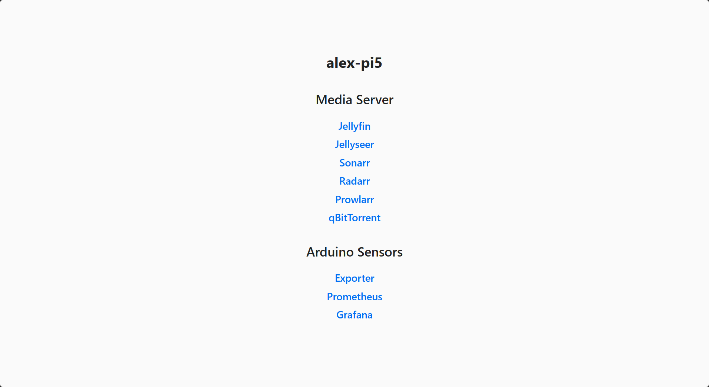

# Minimal web portal

A minimal configurable dockerized web portal.

Useful if you have many services on different ports on the same machine.

Made for my Raspberry Pi 5.



## Prerequisites

- Docker:

  ```bash
  curl -fsSL https://get.docker.com | sudo sh
  ```

## Configuring Sections

To configure sections / items, edit [src/sections.json](src/sections.json).

## Setup

```bash
docker compose up -d --build
```

## Usage

Open the machine's hostname or IP in a browser.
